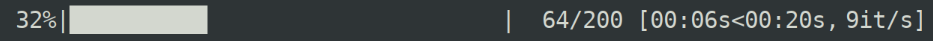
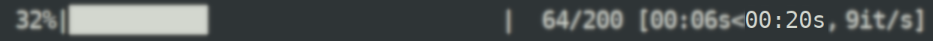
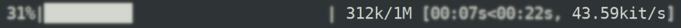

 

# Yaap

Yaap is a straight up port of python venerable [tqdm](https://github.com/tqdm/tqdm) to .NET / CLR

Yaap stands for **Y**et **A**nother **A**NSI **P**rogressbar

Feel free to browse some of the articles like the [Getting Started](articles/start-here.md) page, [FAQ](articles/FAQ.md) or figure out how to get the best looking progress bar under [Windows](articles/Windows.md), alternatively consule the [API](api/index.md) docs

## What does it do

Much like in python, Yaap can make .NET loops, `IEnumerable`s  and more show a smart progress meter.

Here's what Yaap's own Demo looks like:

### [Simple Yaap](#tab/demo1)

### [Color Yaap](#tab/demo2)

---

## What Else

Yaap has the following features:

| Programmatic                                                 | Visual                                                       |
| ------------------------------------------------------------ | ------------------------------------------------------------ |
| Easy wrapping of `IEnumerable<T>` with a Yaap progress bar   | `foreach (var i in Enumerable.Range(0, 1000).Yaap()) { }`    |
| Manual (non `IEnumetable<T>`) progress updates               | `var y = new Yaap(100); y.progress = 99;`                    |
| Low latency (~30ns) on enumeration                           | Checkout the [benchmarks](https://github.com/damageboy/yaap/Yaap.Bench) |
| Zero allocation (post construction)                          | Checkout the [benchmarks](https://github.com/damageboy/yaap/Yaap.Bench) |
| Full progress bar with smooth unicode and numeric progress, time and rate |                        |
| Elapsed time tracking                                        |                |
| Total Time Prediction                                        |                  |
| Rate Prediction                                              |                   |
| Metric Abbreviation for counts (K/M/G...)                    |                 |
| Nested / Multiple concurrent progress bars                   |                 |
| Colors                                                       |                                                              |
| Butter Smooth Progress bars                                  | Yaap can predict progress from rate, allowing smooth progress bars, even on slow/choppy enumeration |
| Turn elements on/off                                         |                                                              |
| Works on Windows                                             | [But you have to work for it, at least bit](articles/Windows.md) |
| Dynamic Resizing                                             |                                                              |
| Constant Width                                               |                                                              |
| Stall Detection                                              |                                                              |
